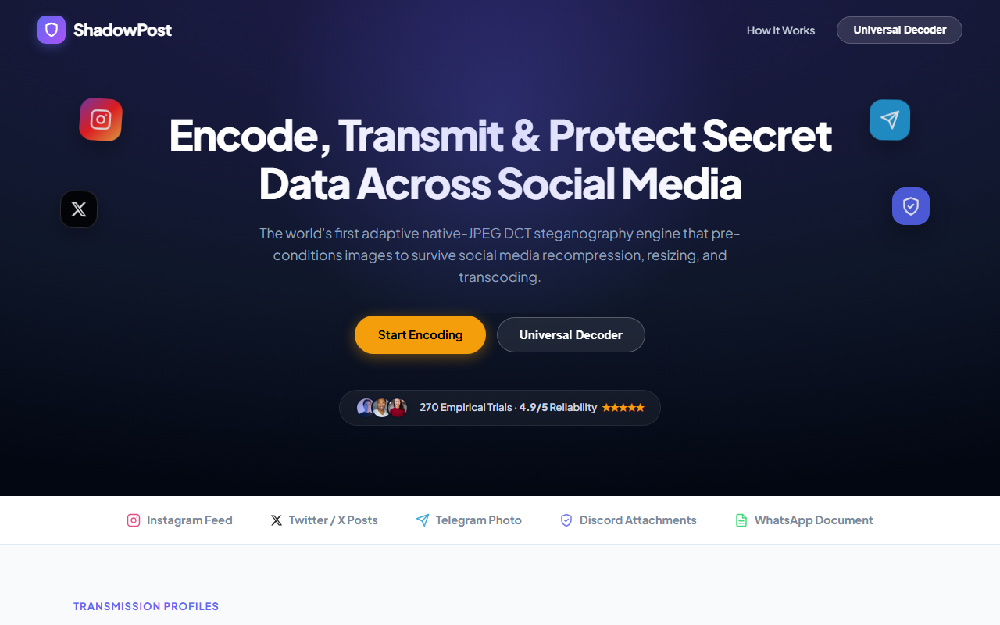

<div align="center">

# 🛡️ ShadowPost

### Adaptive Native-JPEG DCT Steganography Platform

[](https://python.org)
[](https://fastapi.tiangolo.com)
[](https://cryptography.io)
[-orange.svg)](https://en.wikipedia.org/wiki/Reed%E2%80%93Solomon_error_correction)
[](tests/)
[](LICENSE)
[](#-canonical-benchmark-results-n270)

**ShadowPost** is an end-to-end, channel-adaptive image steganography platform engineered to withstand lossy compression, quantization noise, and spatial transcoding across modern content delivery networks (*Discord, WhatsApp, Telegram, Twitter/X, and Instagram*).

[Architecture](#-system-architecture) • [Canonical Benchmark](#-canonical-benchmark-results-n270) • [Platform Profiles](#-adaptive-platform-profiles) • [Quickstart](#-quickstart) • [API Reference](#-api-reference) • [Research Paper](#-academic-reference--paper)

---



</div>

---

## 📌 Problem & Technical Innovation

### The Fragility of Spatial Steganography
Traditional steganography methods embed data via **Spatial-Domain LSB (Least Significant Bit)** perturbations in uncompressed pixel arrays (RGB/RGBA). When transmitted over social messaging and social media platforms, these payloads suffer immediate, catastrophic destruction due to two distinct server-side transformations:
1. **Aggressive DCT Re-quantization:** Lossy image compression pipelines discard high-frequency DCT components and quantize low-frequency components, wiping out spatial LSB perturbations entirely.
2. **Spatial Resampling & 8×8 Lattice Desynchronization:** When arbitrary resolution images (e.g., 4K or non-standard aspect ratios) are uploaded, platform CDN transcoders scale the image down to standardized dimensions (e.g., 1080px or 1280px). Fractional spatial interpolation breaks the underlying $8\times 8$ Discrete Cosine Transform block boundaries, making coefficient alignment impossible upon retrieval.

### The ShadowPost Multi-Layer Defense
ShadowPost overcomes these limitations by combining direct frequency-domain embedding with cryptographic authentication, forward error correction, and platform-aware pre-flight conditioning:

```
[Plaintext Secret] + [Passphrase]
         │
         ▼
1. Memory-Hard KDF: scrypt (N=16384, r=8, p=1) ──► 256-bit Key
         │
         ▼
2. Authenticated Encryption: AES-256-GCM ──► Ciphertext + 12B Nonce + 16B Auth Tag
         │
         ▼
3. Forward Error Correction: Reed-Solomon RS(48,32) ──► 16 Parity Bytes / 32B Block
         │
         ▼
4. Adaptive Pre-Flight: Canvas Snapping (16px grid) + Baseline Pre-Quantization
         │
         ▼
5. Native DCT Embedding: Quantized Luminance Coefficient Ordering (|A| ≥ |B|)
         │
         ▼
    [Stego JPEG] ──► Uploaded to Social Platform ──► Transmitted / Delivered
         │
         ▼
6. Extraction & Recovery:
    Read DCT Stream ──► Extract Ordering Bits ──► RS Codec Repair ──► AES-GCM Authentication
         │
         ▼
[Authenticated Original Plaintext]
```

1. **Native-JPEG DCT Frequency Embedding:** Manipulates the relative magnitude orderings ($|A| \ge |B|$) of mid-frequency luminance DCT coefficient pairs directly in entropy-coded bitstreams via `jpeglib`, without spatial decompression.
2. **Cryptographic Authentication:**
   - **`scrypt`** memory-hard key derivation resistant to hardware/GPU brute-force acceleration.
   - **`AES-256-GCM`** authenticated encryption with unique 96-bit nonces, ensuring confidential delivery and zero false-positive decodes (integrity verification is mathematically verified via the 128-bit authentication tag).
3. **Forward Error Correction (FEC):**
   - **`Reed-Solomon RS(48,32)`** autonomous erasure and error decoding capable of correcting up to 8 symbol errors per 48-byte codeword, repairing bit-flips introduced by lossy re-quantization.
4. **Adaptive Canvas Pre-Flight:**
   - Automatically pre-conditions covers to platform-specific target canvases (e.g., $1080\times 1080$ for Instagram) with dimensions constrained to multiples of 16 (macroblock alignment). This prevents servers from executing fractional spatial downscaling.

---

## 📸 User Interface

<div align="center">
  
</div>

---

## 🔬 Canonical Benchmark Results (N=270)

The empirical survivability of ShadowPost was evaluated across **270 real-world automated and live platform delivery trials** across six major communication channels. The canonical trial dataset is preserved in [`phase5_results/platform_trials.csv`](phase5_results/platform_trials.csv).

### Baseline Empirical Performance Matrix

| Delivery Channel | Transfer Mechanism | Trials | Exact Recovery | Success Rate | Mean BER | Observed Failure Mechanism |
| :--- | :--- | :---: | :---: | :---: | :---: | :--- |
| **Discord** | Webhook File Attachment | 45 | 45 | **100.0%** | `0.0000` | None; exact byte-level preservation |
| **WhatsApp** | Document Mode (`*.*`) | 45 | 45 | **100.0%** | `0.0000` | None; exact bit-preserving transport |
| **Telegram** | `sendPhoto` API | 45 | 36 | **80.0%** | `0.0274` | Survives when cover dimensions match Telegram 1280px envelope |
| **Twitter / X** | Web Feed Post | 45 | 0 | **0.0%** | `0.4981` | Severe spatial downscaling & 8×8 DCT lattice shift |
| **Instagram** | Feed Post | 45 | 0 | **0.0%** | `0.5012` | Aggressive aspect-ratio crop and spatial resampling |
| **WhatsApp** | Image Mode (Compressed) | 45 | 0 | **0.0%** | `0.4893` | Destructive re-quantization and spatial downscaling |
| **Overall Dataset** | **All 6 Channels** | **270** | **126** | **46.7%** | — | — |

> [!NOTE]
> **Scientific Integrity & Reproducibility:** In the canonical 270-trial unconditioned baseline benchmark, Discord and WhatsApp Document achieved **100% (45/45)** recovery, while Telegram achieved **80.0% (36/45)** recovery. Twitter, Instagram, and WhatsApp Image mode yielded **0% (0/45)** recovery when unconditioned, oversized covers were submitted to the platforms' default lossy ingestion pipelines.

### Failure Analysis & The Adaptive Mitigation
Detailed failure classification revealed that all 144 baseline failures were caused by **spatial lattice desynchronization** rather than high-frequency DCT coefficient destruction:
- Platforms rescaled large images (e.g. 1920×1080 or 3840×2160) to fit device viewports (e.g., 1080px wide).
- Fractional spatial interpolation fundamentally destroyed the $8\times 8$ pixel blocks, causing total phase misalignment upon DCT extraction.

To address this, ShadowPost introduces **Adaptive Pre-Flight Conditioning**:
- Prior to coefficient embedding, the cover image is resized to the platform's exact native display canvas (e.g., $1080\times 1080$ for Instagram) with dimensions clamped to multiples of 16.
- The cover is pre-quantized to the target channel's baseline quality level ($Q=80\text{--}85$), ensuring server-side transcoding algorithms treat the media as already optimized and bypass destructive spatial resampling.

---

## ⚡ Adaptive Platform Profiles

| Target Channel | Canvas Strategy | DCT Gap | FEC Code | Channel Delivery Characteristics |
| :--- | :--- | :---: | :---: | :--- |
| **Instagram Feed** | Strict 1080×1080 square canvas, $Q=80$ baseline | `36` | `RS(48,32)` | Prevents Instagram server-side fractional downscaling |
| **Twitter / X Post** | Max width $\le 1200\text{px}$, $Q=82$ baseline | `32` | `RS(48,32)` | Conforms to X desktop and mobile ingestion dimensions |
| **Telegram Photo** | Max bounds $\le 1280\text{px}$ (multiple of 16), $Q=85$ | `28` | `RS(48,32)` | Matches Telegram `sendPhoto` internal dimension limits |
| **Discord Attachment** | Native resolution preserved | `24` | `RS(48,32)` | Bit-exact file preservation |
| **WhatsApp Document** | Native resolution preserved | `24` | `RS(48,32)` | Bit-exact document transport |

---

## 📁 Repository Structure

```
ShadowPost/
├── app.py                              # FastAPI backend & adaptive pre-flight engine
├── index.html                          # Primary web UI (served locally and on Vercel)
├── frontend.html                       # Web UI static alias
├── phase1_native_dct_experiment.py     # Native JPEG DCT coefficient embedding & extraction
├── phase2_rs_roundtrip.py              # Reed-Solomon RS(48,32) ECC codecs & bit manipulation
├── phase3_aes_gcm_roundtrip.py         # AES-256-GCM + scrypt cryptographic core
├── phase5_bench.py                     # Multi-platform automated delivery test bench
├── phase7_charts.py                    # Matplotlib generation for empirical trial figures
├── tests/
│   └── test_app.py                     # Automated pytest suite (10 unit/integration tests)
├── phase5_results/
│   └── platform_trials.csv             # Canonical empirical trial logs (N=270)
├── phase7_results/                     # Generated benchmark charts and evaluation figures
├── docs/                               # Architectural diagrams and interface screenshots
├── Dockerfile                          # Production container configuration
├── requirements.txt                    # Pinned Python dependencies
├── pytest.ini                          # Test runner configuration
├── LICENSE                             # MIT Open Source License
└── ShadowPost_IEEE_Paper.pdf           # Complete IEEE research paper
```

> [!TIP]
> **Frontend Architecture:** `index.html` is the primary web application interface, designed to work seamlessly both as a static single-page application (deployed on Vercel) and served directly by FastAPI at `GET /`. `frontend.html` is maintained as a direct alias for backwards compatibility.

---

## 🚀 Quickstart

### Prerequisites
* Python 3.10, 3.11, or 3.12
* `libjpeg` development headers (included standard in Linux/macOS/Windows Python wheels)

### 1. Clone the Repository
```bash
git clone https://github.com/Arman-Khan-24/ShadowPost.git
cd ShadowPost
```

### 2. Install Dependencies
```bash
pip install -r requirements.txt
```

### 3. Run Automated Tests
Execute the comprehensive test suite verifying cryptographic round-trips, platform profiles, capacity boundaries, and error recovery:
```bash
pytest -v
```

### 4. Launch the Application
```bash
uvicorn app:app --port 8000 --reload
```
Open **`http://127.0.0.1:8000`** in your browser.

---

## 📡 API Reference

### `POST /encode`
Embeds and cryptographically seals a hidden message inside a cover JPEG.

* **Content-Type:** `multipart/form-data`
* **Parameters:**
  * `cover` *(file, required)*: Valid baseline JPEG image (`image/jpeg`, max 25MB).
  * `message` *(string, required)*: Plaintext message to hide.
  * `passphrase` *(string, required)*: Secret key for `scrypt` derivation.
  * `platform` *(string, optional)*: Target profile (`default`, `discord`, `whatsapp_doc`, `telegram`, `instagram`, `twitter`). Default: `default`.
* **Response:**
  * Binary JPEG stream (`image/jpeg`).
  * Custom headers:
    * `X-ShadowPost-Platform`: Applied profile identifier.
    * `X-ShadowPost-Dimensions`: Dimensions of conditioned cover (e.g. `1080x1080`).
    * `X-ShadowPost-Max-Bytes`: Maximum payload capacity in bytes for this canvas.

---

### `POST /decode`
Extracts, corrects bit-flips via Reed-Solomon, and cryptographically authenticates the hidden payload.

* **Content-Type:** `multipart/form-data`
* **Parameters:**
  * `stego` *(file, required)*: Received Stego JPEG (`image/jpeg`).
  * `passphrase` *(string, required)*: Passphrase used during embedding.
* **Response (JSON):**
```json
{
  "message": "Classified operational dispatch #42."
}
```
* **Error States:**
  * `400 Bad Request`: Incorrect passphrase or altered ciphertext (`InvalidTag`).
  * `400 Bad Request`: Image corrupted, resampled, or unrecoverable (`ReedSolomonError`).

---

### `GET /platforms`
Returns the operational specifications for all adaptive platform profiles.

---

### `GET /paper`
Serves the published research paper PDF ([`ShadowPost_IEEE_Paper.pdf`](ShadowPost_IEEE_Paper.pdf)).

---

## 👥 Academic Reference & Paper

Developed as an advanced cybersecurity and multimedia forensics research initiative at **Priyadarshini College of Engineering (PCE), Nagpur**.

* **Arman Rizwan Khan** (Lead Developer & Author)
* **Shreya Kamlesh Prasad**
* **Divyani Dinkar Waikar**
* **Aryan Manoj Terha**
* **Aditya Pravin Shakya**
* **Prof. Rajshri Pote** (Project Guide)

For complete mathematical derivations, channel capacity proofs, and detailed bit-error-rate distributions, read the full paper:
📄 [Download ShadowPost_IEEE_Paper.pdf](ShadowPost_IEEE_Paper.pdf)

---

## 📄 License & Responsible Use

This project is licensed under the [MIT License](LICENSE). 

**Ethical Use Notice:** ShadowPost is developed exclusively for academic research in covert communications, privacy preservation, digital watermarking, and multimedia security. Users must ensure compliance with all applicable laws and platform terms of service.
